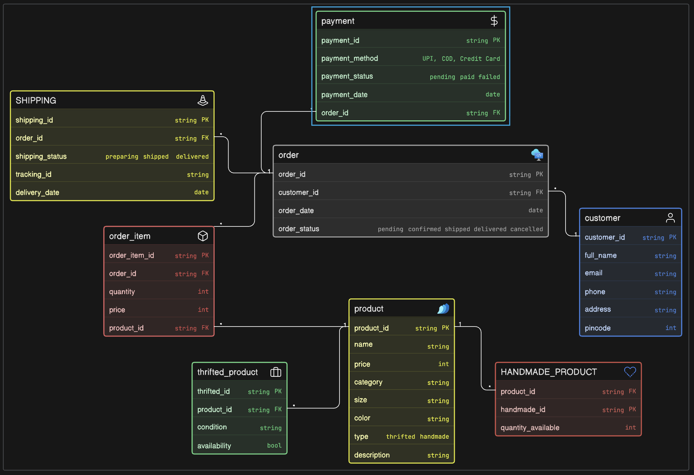

# Instagram Thrift + Handmade Store ER Diagram

## Diagram Access
- Eraser workspace link: https://app.eraser.io/workspace/T8CGC8yVN9nVH1KFLc9C
- Shared diagram image: The ER diagram screenshot shared with this submission represents the same board.

## Project Overview
This project designs an Entity Relationship Diagram (ERD) for a small Instagram-based store that sells:
- thrifted fashion items (usually unique pieces)
- handmade products (often available in multiple quantities)

The goal is to model the real business flow from product listing to order placement, payment, and shipping.

## Business Requirements Covered
- Track products being sold
- Identify whether an item is thrifted or handmade
- Store quantity and availability
- Keep customer details
- Track which customer placed which order
- Support orders containing multiple products
- Track payment status
- Track shipping and delivery status

## Entities in the ER Diagram

### 1. customer
- customer_id (PK)
- full_name
- email
- phone
- address
- pincode

### 2. product
- product_id (PK)
- name
- price
- category
- size
- color
- type (thrifted, handmade)
- description

### 3. thrifted_product
- thrifted_id (PK)
- product_id (FK)
- condition
- availability

### 4. HANDMADE_PRODUCT
- handmade_id (PK)
- product_id (FK)
- quantity_available

### 5. order
- order_id (PK)
- customer_id (FK)
- order_date
- order_status (pending, confirmed, shipped, delivered, cancelled)

### 6. order_item
- order_item_id (PK)
- order_id (FK)
- product_id (FK)
- quantity
- price

### 7. payment
- payment_id (PK)
- payment_method (UPI, COD, Credit Card)
- payment_status (pending, paid, failed)
- payment_date
- order_id (FK)

### 8. SHIPPING
- shipping_id (PK)
- order_id (FK)
- shipping_status (preparing, shipped, delivered)
- tracking_id
- delivery_date

## Relationship Mapping and Cardinality
- One customer can place many orders.
- One order belongs to one customer.
- One order can contain many order items.
- One product can appear in many order items.
- Order and product are many-to-many through order_item.
- One order has one payment record in the current model.
- One order has one shipping record in the current model.
- One product can have subtype details in thrifted_product or HANDMADE_PRODUCT.

## Why This Model Fits the Business
- It separates common product details from product-type-specific details.
- It supports both single-piece thrift items and multi-unit handmade items.
- It captures full order lifecycle: order creation, payment, and shipping.
- It keeps order lines in a separate table, which is required for multi-item orders.

## Normalization and Design Quality
- Core entities are separated to avoid duplicate data.
- Junction table (order_item) resolves many-to-many correctly.
- Payment and shipping are isolated from product/order item details.
- Primary keys and foreign keys are clearly defined in each table.

## Notes for Improvement (Optional Future Refinements)
- Add a separate inventory table for centralized stock tracking.
- Enforce strict product type rules so each product is either thrifted or handmade (not both).
- Use controlled enum values for product type and condition.
- Move shipping address to shipping/order level for per-order delivery flexibility.

## Submission
This repository contains the ERD work for the Instagram thrift + handmade store database design assignment.
The primary visual source is the Eraser board linked above and its shared diagram image.
